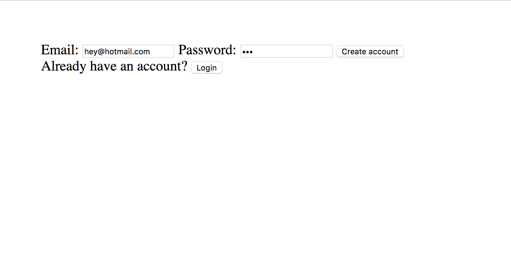
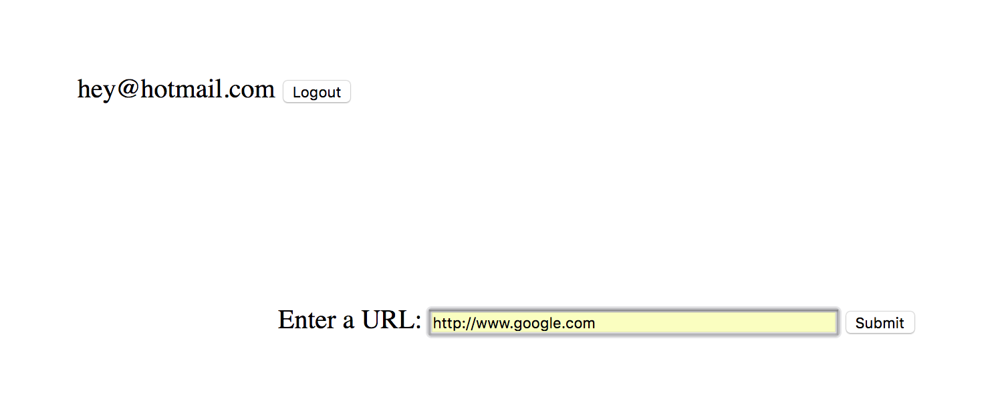
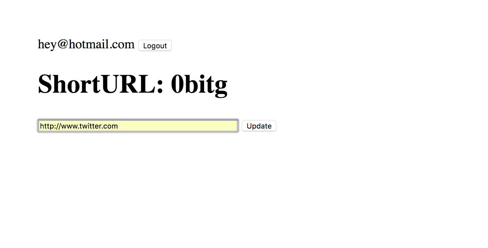

# TinyApp Project

TinyApp is a full stack web application built with Node and Express that allows users to shorten their links!

## Final Product

## Dependencies

- Node.js
- Express
- EJS
- bcrypt
- body-parser
- cookie-session

## Getting Started

- Install all dependencies (using the 'npm install' command).
- Run the development web server using the 'node express_server.js' command.

## TinyApp Instructions

1. Navigate to localhost8080/register to register yourself as a new user.
2. Navigate to localhost8080/urls/new to enter a long link to be shortened.
3. You may change the link to be shortened should you change your mind.
4. Links may be edited/deleted from the URL page